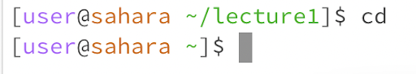
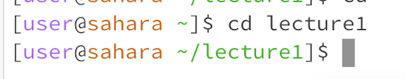
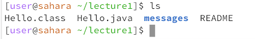
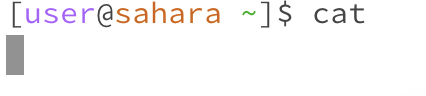
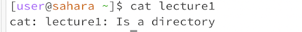
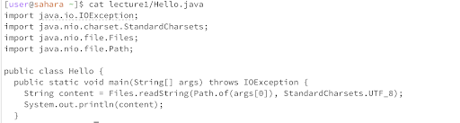

# Lab Report 1 - Ryan Wong
## CD
1. 
    > This resulted in my working directory returning to the top level, root, directory.
    > **NOT** an error
2. 
    > This resulted in my working directory going to /lecture1/.
    > **NOT** an error
3. 
    > This resulted in my working directory not changing
    > **IS** an error as I cannot change the my working directory to a file.

## LS
1. 
    > This resulted in the contents of the lecture1 directory being printed.
    > **NOT** an error 
2. 
    > This resulted in the contents of messages directory being printed.
    > **NOT** an error
3. 
    > This resulted in Hello.java being printed as it is a file.
    > **NOT** an error 

## CAT
1. 
    > This resulted in nothing being printed as a file was not specified.
    > **IS** an error as I cannot print the content of nothing
2. 
    > This resulted in an error message as lecture1 is a directory.
    > **IS** an error as I cannot print a directory
3. 
    > This resulted in the contents of Hello.java being printed.
    > **NOT** an error 
