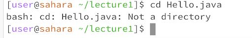

# Lab Report 1 - Ryan Wong
## CD
1. 
    > This resulted in my working directory returning to the home directory of my system!

    > **NOT** an error
2. 
    > This resulted in my working directory going to /lecture1/.
    > **NOT** an error
3. 
    > This resulted in my working directory not changing, remaining at /lecture1/.

    > **IS** an error as I cannot change the my working directory to a file.

## LS
1. 
    > This resulted in the contents of the lecture1 directory being printed.

    > **NOT** an error 
2. 
    > This resulted in the contents of lecture1/messages directory being printed.

    > **NOT** an error
3. 
    > This resulted in Hello.java being printed as it is a file.

    > **NOT** an error 

## CAT
1. 
    > This resulted in nothing being printed as a file was not specified. If I try to enter an input, the terminal will be unresponsive and my input text will simply display without doing any action. I will then have to send a SIG-KILL signal using ctrl+c to kill the operation as using cat without a parameter will produce an error!

    > **IS** an error as I cannot print the content of nothing
2. 
    > This resulted in an error message as lecture1 is a directory. cat is supposed to print the contents of a file, so trying to print the contents of a directory, which is not a file, does not make sense and causes an error!

    > **IS** an error as I cannot print a directory
3. 
    > This resulted in the contents of lecture1/Hello.java being printed.

    > **NOT** an error 
